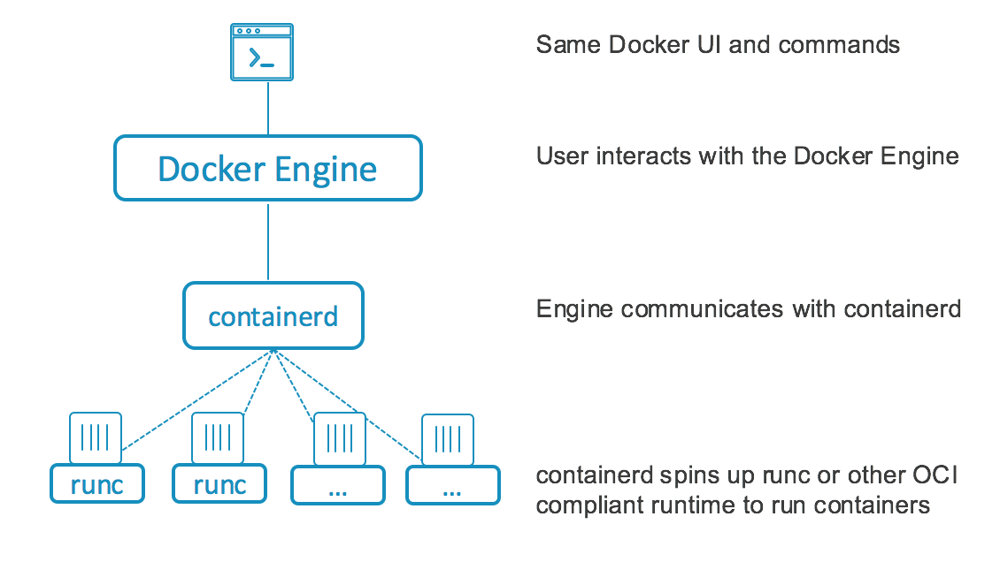
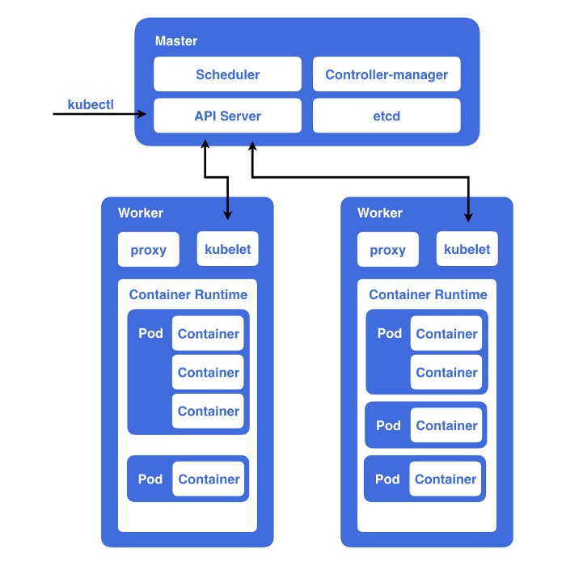
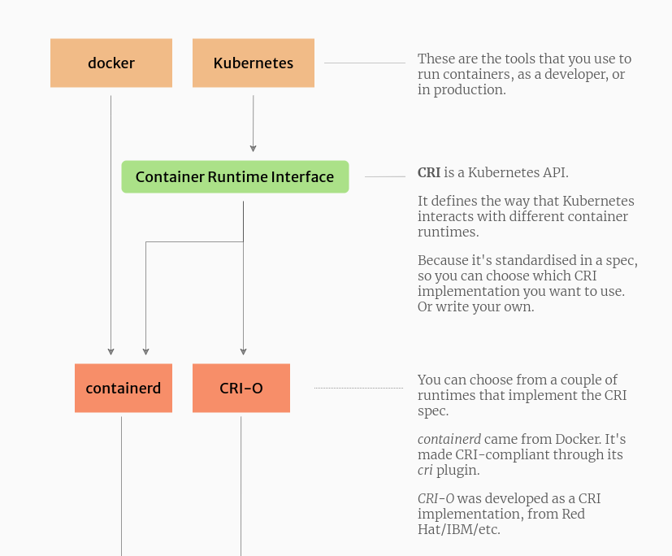

# Wow Docker 好方便！那他跟 kubernetes 差在哪裡？

首先，docker 是無法跟 kubernetes 比較的，docker 是運行 container 的一種方式，許多人會認為 docker == container == image ，但實際上 docker ≠ container ≠ image。

在了解 kubernetes 前我們要先理解 container 到底是怎麼運作的。

# container 、 container engine 、 container runtime ???

docker 的基本概念可以參考下圖



當使用者輸入 `docker ...` 其實是在告訴 docker engine(container engine) 使用者要跑一些 image 這時候 docker engine 就會告訴 containerd (container runtime) 該做什麼事（比如說要 pull image 、 建立 container 之類的）containerd 就會根據 docker engine 的指令做事。（備註： 圖中的 runc 其實也是 container runtime 因為 container runtime 有分 high level 與 low level ...）

為什麼執行一個 container 要用到那麼多個元件呢？為什麼不直接跟 container runtime 溝通就好？

其實是可以的， containerd 本身有提供一個 command line tool 叫做 ctr ，但是透過 ctr 運行 container 是非常複雜的，所以有了 docker engine 把這個步驟包裝成使用者比較好操作的指令。

你也可以把 docker engine 想像成應用程式的前端，使用者只要輸入指令就好，其他複雜的操作就交給後端（containerd）處理。

透過 docker 執行 container 只是其中一個方法而已，現今有許多不同的 container engine （例如：Docker, Podman...）以及不同的 container runtime （例如：containerd, CRI-O...）

# Kubernetes 到底是什麼？

首先，我們先設想一個環境：你的公司將所有的程式容器化跑在 docker 上面，但隨著使用者人數越來越多伺服器沒辦法承受那麼大的流量，這時候你會怎麼辦？

1. 買更多 CPU 更多 RAM 的機器
2. 買更多台機器

這個其實就是 scalability 的問題，方案 1. 就是所謂的 Vertical Scaling 、 方案 2. 就是所謂的 Horizontal Scaling 。（兩者詳細的差別可參考 [影片](https://youtu.be/xpDnVSmNFX0)）而 kubernetes 就是透過 horizontal scaling 來解決這個問題。簡而言之就是在多台機器上運行 container 。

wow ~ kubernetes 這麼厲害那這套軟體是怎麼運作的？如果你這麼想那就表示你也落入許多人都會有的迷思。

kubernetes 不能算是一個軟體、一套軟體，將他形容為一套系統、架構比較合適。透過這個架構運行管理容器就可以算是 kubernetes 。（備註： 可以參考 k3s, micro-k8s, openshift...）

# kubernetes 的架構

如果你要在五台機器上跑 container 你會怎麼做？你可能會想透過手動的方式一台一台運行。那假設有 20 台怎麼辦？或許你會想用 script 或 ansible 之類的工具自動化這個流程。那如果 container 跟 container 之間要在同一台機器、甚至是跨機器溝通怎麼辦？⋯⋯還好我們不需要面對接下來的種種麻煩因為 Google 工程師早就在老早前就想過這個問題了，所以就開發了 Kubernetes 這個系統去解決這個問題。



## 名詞解釋

- Node：同常為一台伺服器，或著是一台 VM 有自己獨立的 IP 位址，儲存空間等等。
- Pod：Pod 為 Kubernets 運作時的最小單位，一個 pod 內含一個或多個容器，而這些容器則會組成一個應用（application），亦即一個 pod 會對應到一個應用。
- Cluster：所有 Node 的集合。

## api server

<aside> 💡 嘿 kubernetes 我要跑一個 Pod ！

</aside>

還記得 docker 運行的流程嗎？使用者向 docker-engine 發送指令然後 docker-engine 會根據指令去控制 containerd 。kubernetes 其實也很類似！使用者只要向 kube-api server 發送指令， kube-api server 就會根據指令做相對應的事情。與 docker 不同的是 kubernetes 的指令稍微複雜一點，通常會用 yaml 格式表示例如以下：

```yaml
apiVersion: v1
kind: Pod
metadata:
  name: nginx
spec:
  containers:
  - name: nginx
    image: nginx:1.14.2
    ports:
    - containerPort: 80
```

我們來看一下其中的一些名詞：

- apiVersion：apiVersion 不同也表示其 api 格式會有所不同。
- kind：kubernetes 的 api 可以分為很多種類，而其中 Pod 為其中一種。
- image：要運行的 container image
- ports：與 port 相關的設定

不過我們通常不會這樣運行 Pod 而是用 Deployment 這個方法（原因待會解釋），如以下：

```yaml
apiVersion: apps/v1
kind: Deployment
metadata:
  name: nginx-deployment
  labels:
    app: nginx
spec:
  replicas: 1
  selector:
    matchLabels:
      app: nginx
  template:
    metadata:
      labels:
        app: nginx
    spec:
      containers:
      - name: nginx
        image: nginx:1.14.2
        ports:
        - containerPort: 80
```

我們來看一下其中的一些名詞：

- kind：注意到這邊使用的是 Deployment 與原本的 Pod 不一樣。
- .spec.template.labels：我們在這裏給予 Pod 一個標籤，之後可以透過這些標籤管理特定的 Pod
- .spec.selector.matchLabels：注意到這裏與 `.spec.template.labels` 一樣，等等會詳細解釋為什麼需要這樣。

## scheduler

<aside> 💡 我的 Pod 到底會在哪個 Node 上跑呢？

</aside>

我們成功的告訴 api server 我們要跑一個 Pod 但我們面臨一個難題：我有好多台 Node ，倒底要在哪一台跑呢？kubernetes 的 scheduler 就是要解決這個問題。scheduler 在決定要在哪一個 Node 上跑 Pod 時會有兩個步驟：

1. Filtering：scheduler 會根據一些規則（taints, labels...）先過濾掉一些 Node。比如說我可以指定某個 Pod 只能跑在有 ssd 的 Node 上，scheduler 就會在這個階段過濾掉沒有 ssd 的 Node。
2. Scoring：scheduler 會根據一些規則與權重給每一台 Node 打分數，最後選擇分數最高的 Node。比如說我把『剩餘記憶體的容量』設為規則並給它高權重，scheduler 最後就會選擇剩餘記憶體容量最多的 Node 。

## controller manager

<aside> 💡 我決定好要在哪台 Node 上跑了，快點告訴 api server 吧！

</aside>

### desired state 與 current state

在上述的例子中我們想要在某個 Node 上跑某個 Pod 可以說是我們的 desired state ，而 Node 目前沒有跑任何一個 Pod 可以說是我們的 current state 。controller 的工作就是不斷檢查我們的 desired state 與 current state 有沒有出入並且盡可能的將我們的 current state 變成 desired state 。

這時候你可能會有一個疑問：為什麼不把這個工作交給 scheduler 就好？當 scheduler 決定哪一台 Node 後直接在目標 Node 運行 Pod 就好了？

如果我們是透過 `kind:Pod` 的方式告訴 api server 的話的確不會用到 controller 的機制。但是我們現在是透過 `kind:Deployment` 的方式告訴 api server 。

這樣做其實有個重要原因是 current state 隨時在變化，比如說有些 Pod 有可能會被移除 ，這時候就會需要 controller 去檢查 Cluster 的狀態，如果有 Pod 個數不符合 desired state ， controller 就會自動重新開一個 Pod 。

我們再回到前面講到為什麼要用 Deployment 而不是用 Pod ，如果我們的 api 使用 `kind:Pod` 的方式運行 Pod 的話，就不會有 controller 的機制去監測 Pod 的狀態，也就是說當 Pod 被移除時就不會有 controller 自動重新開一個 Pod 。

## ETCD

<aside> 💡 最即時，最可靠的儲存系統！

</aside>

在整個 kubernetes 架構中，需要儲存許多重要的東西，比如說 kubernetes 內部的設定、憑證、以及上述提到 desired state 與 current state 等資料。而 kubernetes 採用 etcd 儲存資料，其中最大的原因在於他是分散式且能保持一致性的系統，也就是說當我運行多個 etcd 時，就算有幾個 etcd 壞掉也能保持資料的唯一性。（備註：詳細的演算法可參考這個 [網站](http://thesecretlivesofdata.com/raft/)）

## kubelet

<aside> 💡 api server 主人，我有什麼能為你服務的？

</aside>

在 kubernetes cluster 中每一個 Node 都會有一個 kubelet 運行，kubelet 的主要工作就是根據 api server 給的命令管理 Node 上的 Pod 。

接續上述例子， controller 已經發現 desired state 與 current state 不同，並告訴 api server ，api server 就會告訴 scheduler 指定 Node 的 kubelet ，叫它運行一個 Pod 。

疑？是不是很像之前講的 container engine, container runtime 的架構？沒錯！但有一點不同的是 kubelet 與 container runtime 中間有一層 CRI(Container Runtime Interface)，可以參考下圖：



為什麼要在多一層 CRI ？因為 kubernetes 並沒有綁定一定要用哪一個 container runtime ，而是定義一個規範（CRI）所有支援此規範的 container runtime 都可運行，讓使用者在架設 kubernetes 時有更多的彈性。

## kube-proxy

<aside> 💡 嘿，你是不是想找它說話？

</aside>

在 kubernetes 中 Pod 與 Pod 之間的溝通是非常複雜的，需要考慮到跨 Node 的問題，而 kube-proxy 主要是在解決這個問題。 所以在 kubernetes cluster 中每一個 Node 都會有一個 kube-proxy 負責轉發 TCP、UDP 連線，更詳細的介紹可以參考另一篇 networking in kubernetes。